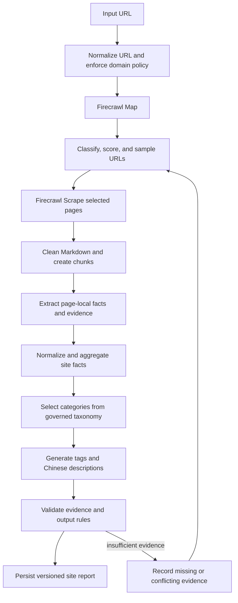
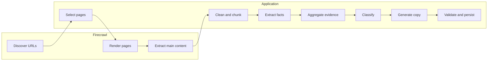
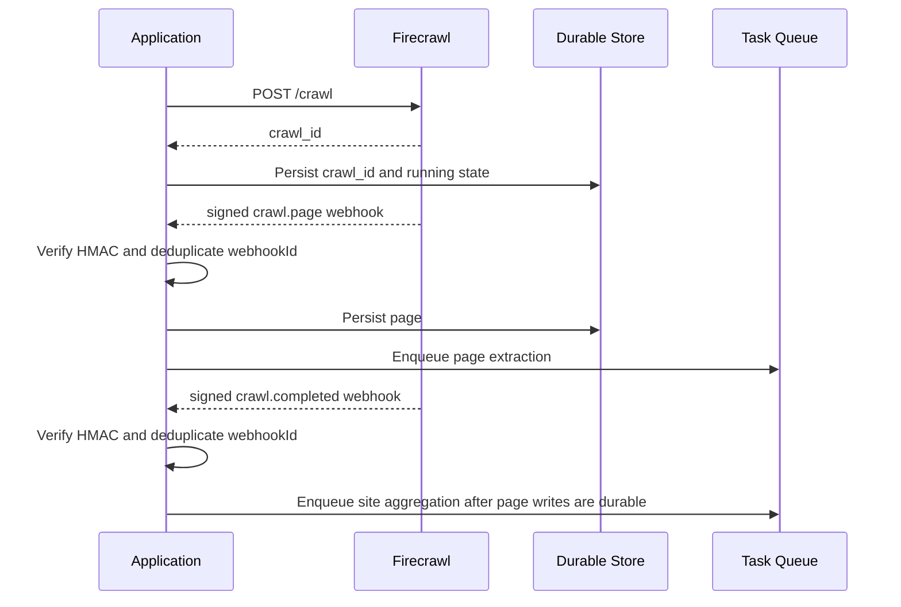

# Architecture Diagrams

## Evidence-first analysis pipeline

```mermaid
flowchart TD
    A["Input URL"] --> B["Normalize URL and enforce domain policy"]
    B --> C["Firecrawl Map"]
    C --> D["Classify, score, and sample URLs"]
    D --> E["Firecrawl Scrape selected pages"]
    E --> F["Clean Markdown and create chunks"]
    F --> G["Extract page-local facts and evidence"]
    G --> H["Normalize and aggregate site facts"]
    H --> I["Select categories from governed taxonomy"]
    I --> J["Generate tags and Chinese descriptions"]
    J --> K["Validate evidence and output rules"]
    K --> L["Persist versioned site report"]
    K -->|"insufficient evidence"| M["Record missing or conflicting evidence"]
    M --> D
```

## Responsibility boundary

```mermaid
flowchart LR
    subgraph FC["Firecrawl"]
      MAP["Discover URLs"]
      RENDER["Render pages"]
      BODY["Extract main content"]
    end
    subgraph APP["Application"]
      SELECT["Select pages"]
      CLEAN["Clean and chunk"]
      EXTRACT["Extract facts"]
      AGG["Aggregate evidence"]
      CLASSIFY["Classify"]
      GENERATE["Generate copy"]
      QA["Validate and persist"]
    end
    MAP --> SELECT --> RENDER --> BODY --> CLEAN --> EXTRACT --> AGG --> CLASSIFY --> GENERATE --> QA
```

## Deferred asynchronous Crawl

```mermaid
sequenceDiagram
    participant App as Application
    participant FC as Firecrawl
    participant Store as Durable Store
    participant Queue as Task Queue
    App->>FC: POST /crawl
    FC-->>App: crawl_id
    App->>Store: Persist crawl_id and running state
    FC-->>App: signed crawl.page webhook
    App->>App: Verify HMAC and deduplicate webhookId
    App->>Store: Persist page
    App->>Queue: Enqueue page extraction
    FC-->>App: signed crawl.completed webhook
    App->>App: Verify HMAC and deduplicate webhookId
    App->>Queue: Enqueue site aggregation after page writes are durable
```
