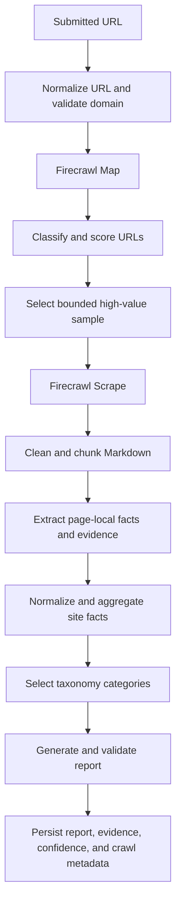
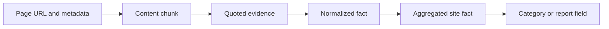

# Architecture Diagrams

## MVP processing flow

The stage boundaries are contract boundaries: retrieval never decides business relevance, page extraction never creates site-wide categories, and report generation never reads raw Markdown directly.

## Evidence lineage

Every core report field must be traceable back through this chain to a source URL and quote.
