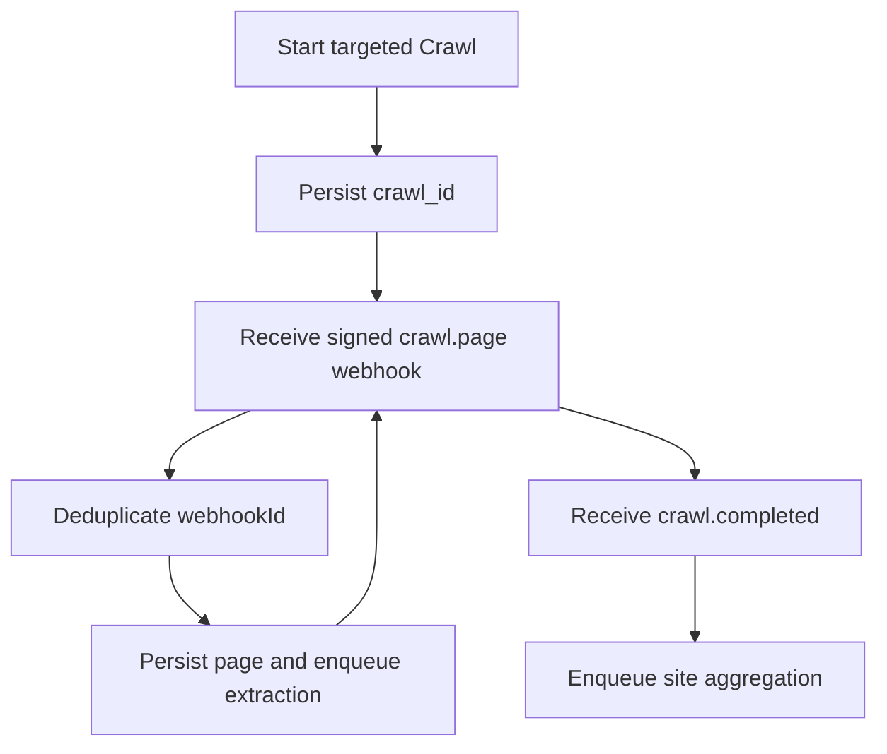

# Deferred Scope

This file preserves source-defined second-stage behavior. None of it is required for MVP acceptance until a later spec update promotes it.

## Targeted Crawl and Webhooks

- Use Crawl only for large product catalogs, coherent path trees, asynchronous multi-page work, incomplete Map discovery, or workflows that require per-page webhooks.
- Constrain Crawl to company, product, service, feature, solution, pricing, and customer paths; exclude login, signup, account, cart, checkout, author, tag, category, and careers paths.
- Initial Crawl defaults are discovery depth three, sitemap inclusion, ignored query parameters, ten-page limit, no external links or subdomains, robots enforcement, 500 ms delay, and concurrency three.
- A production Crawl starts asynchronously, persists `crawl_id`, processes `crawl.page` events page by page, and aggregates only after `crawl.completed`.
- Verify Firecrawl webhook HMAC-SHA256 signatures and deduplicate by `webhookId` before processing.

## Rich-content retrieval

- Enable Firecrawl PDF parsing for eligible documents.
- For pages requiring click, expand, or input actions, first Scrape and then use the scrape interaction endpoint with natural-language instructions or Playwright code.
- Do not use interaction to bypass authentication, CAPTCHAs, robots rules, or permissions.

## Product expansion

- Multilingual term normalization.
- Content-change monitoring and incremental retrieval.
- Bulk website task queues.
- Human review and correction interface.
